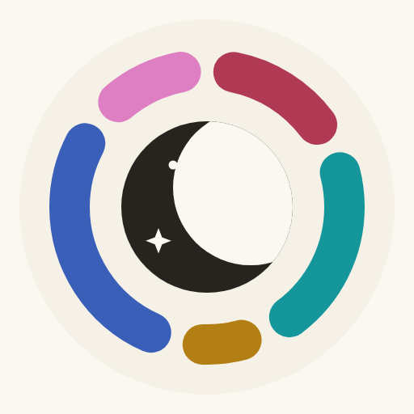
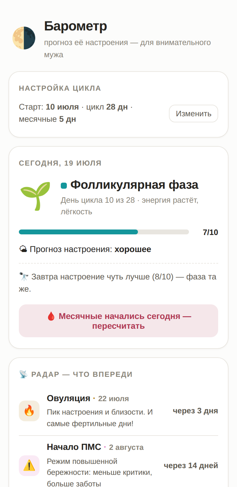

  

<h1 align="center">Барометр</h1>

  Трекер женского цикла — для мужчин. 
  <em>Woman cycle tracker — built for men.</em>

  <a href="https://yetanotherrepo.github.io/Barometr/"><b>Открыть приложение →</b></a>

---

## Что это

Обычные трекеры цикла сделаны для той, у кого цикл. **Барометр** сделан для того, кто рядом: мужа или партнёра, который хочет понимать, в какой фазе цикла сейчас его жена, куда и когда, скорее всего, качнётся её настроение — и как под это подстроить своё поведение.

Вводится одна дата — первый день последних месячных. Длину цикла знать не обязательно: приложение начнёт со средних 28 дней и само уточнит её после следующего цикла.

  

## Возможности

- **Сегодня** — текущая фаза, день цикла, прогноз настроения по шкале 1–10 и прогноз на завтра
- **Радар** — когда ждать ПМС, когда начнутся месячные, когда овуляция и «зелёное окно» для важных разговоров
- **Инструкция на фазу** — чего ожидать, что помогает, чего избегать, плюс идея заботы на каждый день
- **Кривая настроения** на весь цикл и **календарь** с раскраской по фазам
- **Пересчёт одной кнопкой** — когда начинается новый цикл, приложение само предлагает уточнённую длину

## Установка на телефон

Приложение — это сайт, который ставится на главный экран и работает как нативное приложение.

**iOS:** открыть [ссылку](https://yetanotherrepo.github.io/Barometr/) в Safari → «Поделиться» → «На экран "Домой"».

**Android:** открыть в Chrome → меню ⋮ → «Добавить на главный экран» / «Установить приложение».

## Приватность

Никакой регистрации, серверов и аналитики. Все данные хранятся в localStorage браузера на устройстве и никуда не отправляются. Настройки также кодируются в хвосте ссылки (`#d=…`) — так их можно перенести на другое устройство.

## Как устроено

Один файл `index.html` без зависимостей и сборки: ванильный JS, SVG-график, веб-манифест. Модель цикла усреднённая: овуляция ≈ за 14 дней до следующих месячных, ПМС — последние ~5 дней цикла. Палитра фаз проверена на различимость при цветослепоте.

## Дисклеймер

Это не медицинский инструмент и не средство контрацепции. Настроение зависит не только от гормонов, а каждая женщина индивидуальна — прогноз здесь ориентир, а не истина. Главное правило приложения: оно для внимательности, а не для фразы «у тебя просто ПМС». Лучший инструмент по-прежнему — спрашивать и слушать.

---

  Сделано с 🤍 при помощи <a href="https://claude.com/claude-code">Claude</a>

